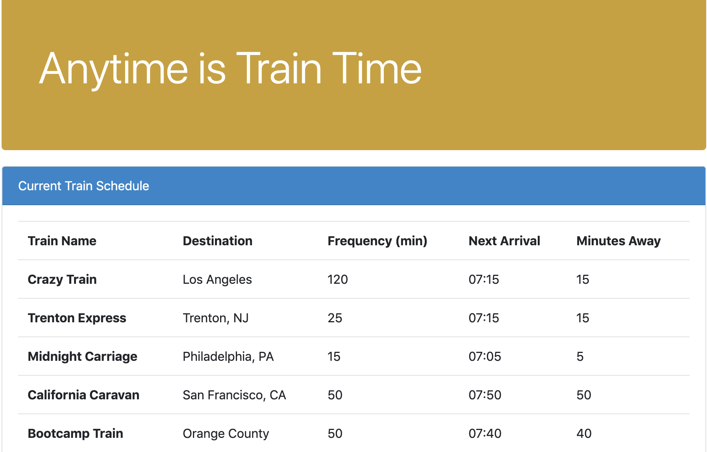
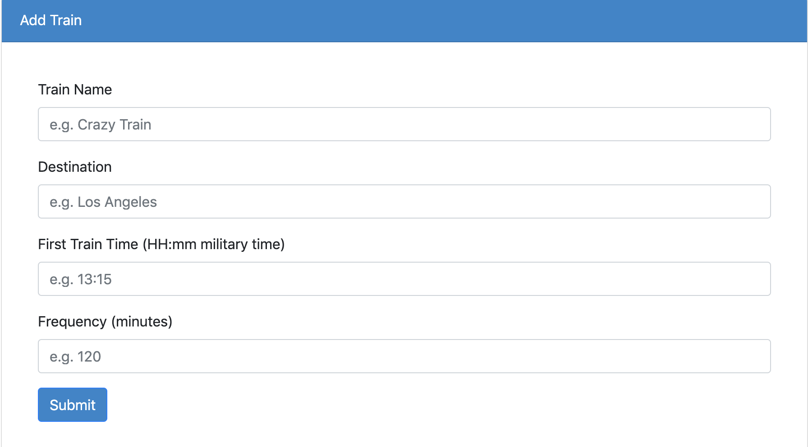

# Train-Scheduler

#### Deployed Link:
* https://bluecam74.github.io/Train-Scheduler/

### About

List of scheduled trains currently stored displayed on browser. User can add trains that will remain saved and displayed on browser. 

***

### Technologies Used

* Javascript

* JQuery

* Firebase

* Moment JS

